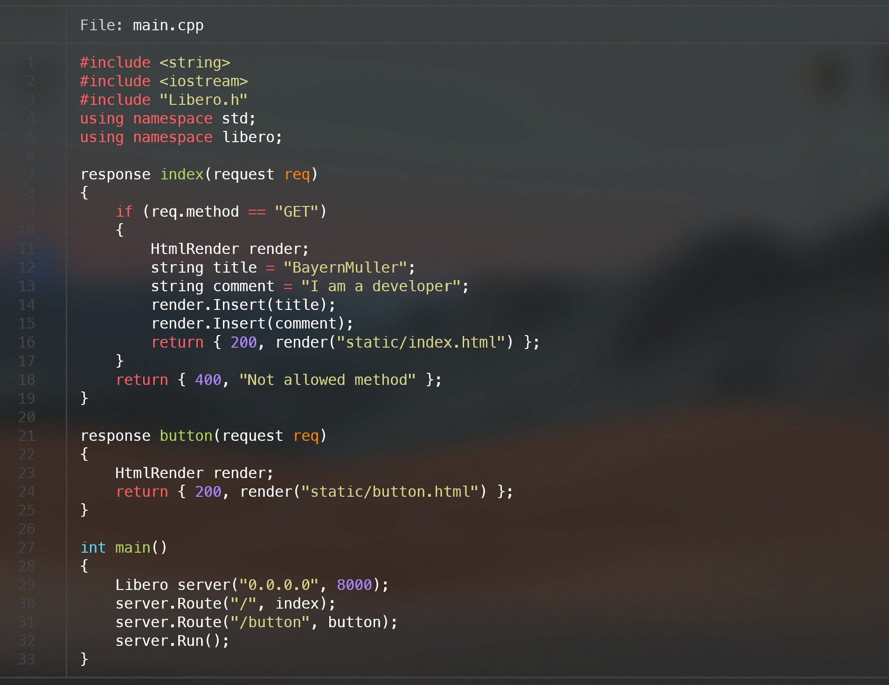

<p align="center">
    
</p>

<span align="center">

# libero

the simplest cross-platform http server framework for c++

</span>

<p align="center">
	 
	
	
    
    
    
</p>

### Introduction

libero is a lightweight, efficient HTTP server designed for simple web application hosting. Built using modern C++ practices, it offers an easy-to-use interface for serving HTML content, with capabilities for request handling and dynamic content rendering. 

This project is structured to separate core functionalities such as TCP connection handling, HTTP server implementation, and HTML rendering, making it easily extendable for further development.

### Getting Started

To get started with libero, simply clone the repository and build the project using `make`. The server can be run using the following command:

```bash
git clone https://github.com/bayernmuller/libero.git
cd libero
make
./app
```

HTTP Server will be running on `localhost:8500` by default. You can change the port by modifying the parameter in `main.cpp`, `main()`.

```text
$ ./app

            __ _  __                     
           / /(_)/ /_   ___   _____ ____ 
          / // // __ \ / _ \ / ___// __ \
         / // // /_/ //  __// /   / /_/ /
        /_//_//_.___/ \___//_/    \____/  

    [https://github.com/bayernmuller/libero]


libero is running on ...
 - http://0.0.0.0:8500
```

### Features

- **Cross-Platform**: libero is designed to work on all major operating systems, including Windows, MacOS, and Linux.
- **Simple Interface**: The server is designed to be easy to use, with a simple API for serving HTML content.
- **Efficient**: The server is built using modern C++ practices, making it efficient and performant.
- **Extendable**: The project is structured to allow for easy extension and modification, with separate modules for core functionalities.


### Contributing

We welcome contributions from the community! If you have any suggestions, bug reports, or feature requests, please open an issue or submit a pull request. 

### License

This project is licensed under the MIT License. See the [LICENSE](LICENSE) file for more details.

### Author

This project is developed and maintained by [BayernMuller](https://github.com/bayernmuller).